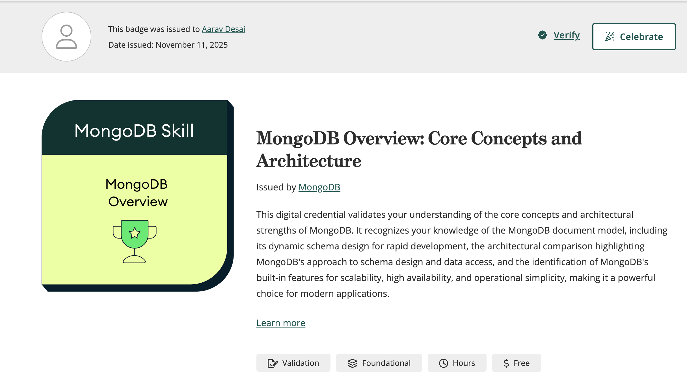

## MongoDB Overview
[MongoDB](https://www.credly.com/badges/70a242d2-8460-4efc-93ae-d244bf7a690d)

## Relational to Document Model
[Relational](https://www.credly.com/badges/d9c41685-0afc-4c2f-8529-f22e99e68ea8)

# Differences
One key difference between relational and non-relational databases is structure. Relational databases like MySQL use fixed schemas with tables, rows, and columns, enforcing strict relationships through keys and constraints. Instead, non-relational databases like MongoDB use flexible, document-based structures that store data in JSON-like formats. This makes MongoDB more adaptable for unstructured data while MySQL is better at enforcing consistency and complex relationships.

# Better at Healthcare
MongoDB would be better for managing electronic health records (EHRs) that include unstructured data such as doctor’s notes, lab results, imaging metadata, and wearable device readings. Since each patient’s record can differ greatly in structure, MongoDB’s flexiblity  allows new data types to be added without redesigning the whole database. 